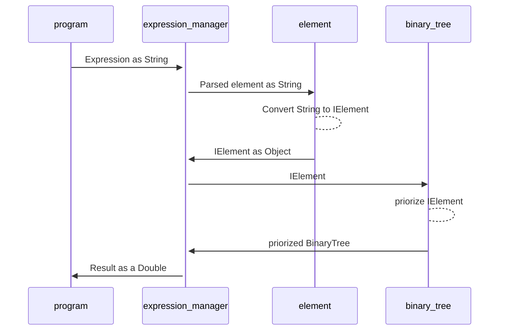

# Introduction:
Simple interpreter that given an arithmetic expression as a string can return the value.

# Packages
## program
### Responsability
- Is only useful to show an example of how the evaluator works
### Dependences
- expression_manager

## expression_manager
### Responsabilities
- Parse the expression
- Validate the expression
- Create all the elements of the expression
- Add the elements to a binaryTree
### Client
- Program
### Dependences
- element
- binary_tree

## element
### Responsabilities- Provide objects that can instance all the elements of the operation
- Provide a global point of acces to the operators.
- Construct operators
- Construct variables
### Client
- Expression

## user_messages
### Responsabilities
- Centralize all the messages that the final user could see.
- Centralize all the exceptions of the evaluator
### Client
- All Packages

## binary_tree
### Responsabilities
- Provide usefull clases to make a BinaryTree
- Provide algorithms to pass over the BinaryTree
- Order IElements in BynaryTrees in base on their priority
### Client:
- expression_manager

# Next Steps 
- Create an OperatorFactory thath given the symbol return the correct Operator
- Create an user_interface

# Sequence Diagram

